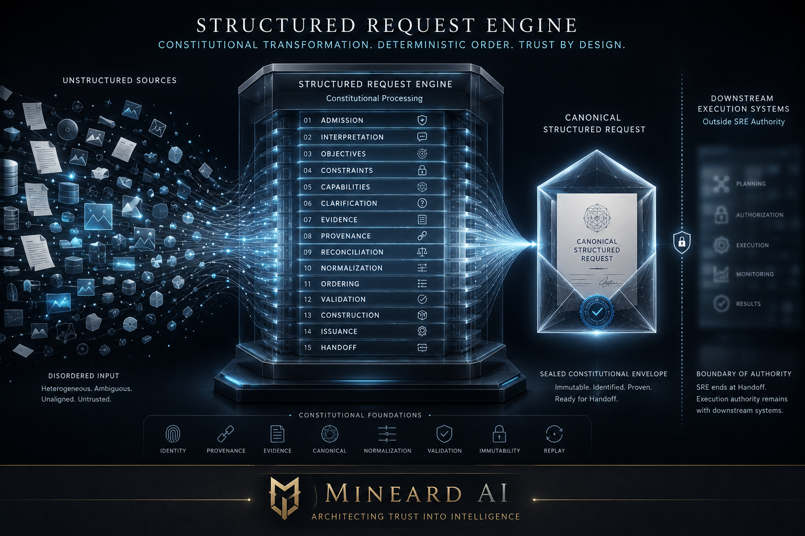

# Structured Request Engine

<p align="center">
  
</p>

## Constitutional transformation. Deterministic order. Trust by design.

> **Mineard AI — Architecting Trust into Intelligence**

Most AI systems move directly from a prompt to an answer or action.

During that jump, several different decisions can become mixed together inside one opaque process: what the request means, which constraints matter, what assumptions are acceptable, whether ambiguity can be ignored, what evidence supports the interpretation, and whether the system should act.

The **Structured Request Engine (SRE)** separates those decisions.

SRE converts supplied source material and explicitly declared interpretation material into an immutable, provenance-preserving, machine-readable representation of what was requested **before** any downstream system is allowed to govern, authorize, plan, generate, invoke tools, or execute.

It does not decide whether the request should be fulfilled.

It ensures that the request is explicit before anyone or anything decides what to do with it.

Repository: <https://github.com/MineardAI/Structured-Request-Engine>

---

## What is SRE?

SRE is a deterministic request-representation engine.

A useful way to think about it is:

> **SRE is a constitutional compiler for requests.**

Like a compiler, it transforms an unstructured source form into a stable intermediate representation. Unlike an execution system, it does not grant permission to run the request, choose a provider, call a tool, or produce a result.

Its successful output is a `CanonicalStructuredRequest`: a versioned, provenance-preserving, deterministically ordered representation of what the engine was able to construct from admitted inputs.

SRE represents the request.

It does not authorize the request.

---

## The problem SRE solves

Without a separate request-representation layer, every model, agent, toolchain, or downstream system may interpret the same request differently.

That creates hidden variation:

- one system may preserve a constraint that another ignores;
- one system may silently resolve ambiguity that another leaves open;
- one system may treat an assumption as fact;
- one system may infer a capability that was never requested;
- one system may act before governance has evaluated the request;
- two systems may appear to process the same prompt while actually operating on different interpretations.

SRE prevents that collapse by creating one inspectable request artifact before downstream action begins.

### Without SRE

```text
Prompt
   |
   v
Opaque Interpretation
   |
   v
Planning / Tools / Execution
   |
   v
Answer or Action
```

Interpretation, assumptions, authority, and execution can become difficult to separate.

### With SRE

```text
Source Input
     |
     v
Structured Request Engine
     |
     v
CanonicalStructuredRequest
     |
     v
Declared Downstream Authority
     |
     v
Governance / Planning / Models / Tools / Execution
```

The request becomes explicit before downstream authority begins.

---

## A simple example

Consider this request:

> “Review this contract and send the important risks to the legal team.”

A normal AI pipeline may silently decide:

- which contract is in scope;
- what “important” means;
- whether legal advice is expected;
- who “the legal team” refers to;
- whether email access is authorized;
- whether confidential content may be transmitted;
- whether sending is part of the request or only a future possibility.

SRE does not immediately act.

It first represents the request:

```text
Objective
  Identify material risks in the supplied contract.

Constraints
  Preserve confidentiality.
  Do not convert analysis into final legal judgment.
  Do not send content without downstream authorization.

Capability requirements
  Document analysis.
  Risk extraction.
  Potential message or email handoff.

Meaning qualification
  "Important" is unresolved.
  "The legal team" is unresolved.
  Sending authority is unresolved.

Evidence and provenance
  Preserve exact source references, supporting material,
  lineage, and decision history.

Result
  CanonicalStructuredRequest
```

Only after that artifact exists may a separate downstream authority decide whether clarification is required, whether the request is permitted, and whether any model, tool, connector, or execution system may be used.

---

## The three layers

### 1. What was supplied

SRE preserves the admitted source material, including user input, structured application data, uploaded artifacts, references, and declared metadata.

The source is not silently replaced by an interpretation.

### 2. What the request is represented as meaning

SRE represents objectives, constraints, capability requirements, ambiguity, assumptions, uncertainty, evidence, grounding, provenance, and semantic relationships.

Representation does not claim absolute truth.

### 3. What may happen next

That decision belongs downstream.

Governance, authorization, planning, provider selection, tool use, generation, execution, and release are outside SRE authority.

---

## Constitutional boundary

```text
Source Input
     |
     v
Structured Request Engine
     |
     v
CanonicalStructuredRequest
     |
     v
Declared Downstream Authority
     |
     v
Governance / Planning / Generation / Tools / Execution
```

SRE ends at governed handoff.

It does not:

- authorize requests;
- determine whether a request is safe, lawful, approved, funded, or executable;
- select providers, models, tools, or connectors;
- establish credential or resource availability;
- plan work;
- execute tasks;
- generate responses; or
- release outputs.

The following distinctions remain explicit:

```text
Representation != Authorization
Interpretation Proposal != Canonical Request
Construction != Issuance
Issuance != Handoff
Handoff != Execution
```

---

## Why this matters

SRE does not promise that every interpretation is correct.

It provides something more defensible:

> **The construction of understanding becomes inspectable.**

SRE can make it possible to verify that:

- source material was preserved;
- interpretation remained a proposal until admitted;
- objectives and constraints were represented explicitly;
- ambiguity, assumptions, and uncertainty remained visible;
- evidence and provenance stayed traceable;
- semantic reconciliation followed declared rules;
- normalization preserved meaning;
- ordering was deterministic;
- validation did not silently repair the request;
- construction preserved exact upstream identity and content;
- issuance did not alter the request;
- handoff did not create execution authority;
- equivalent declared inputs can be replayed deterministically.

That is how SRE turns trust from an assumption into an architectural property.

---

## Request lifecycle

| Contract | Constitutional act | Principal result |
|---|---|---|
| 000 | Establish | Constitutional foundation and authority boundary |
| 001 | Admit | `SourceIntakeRecord` |
| 002 | Bound | `AdmittedInterpretationProposalSet` |
| 003 | Represent | `DeclaredObjectiveSet` |
| 004 | Represent | `DeclaredConstraintSet` |
| 005 | Represent | `CapabilityRequirementSet` |
| 006 | Qualify | `MeaningQualificationSet` |
| 007 | Ground | `InterpretationEvidenceSet` |
| 008 | Trace | `ProvenanceRecordSet` |
| 009 | Reconcile | `SemanticReconciliationSet` |
| 010 | Normalize | `NormalizedRequestRepresentation` |
| 011 | Order | `CanonicallyOrderedRequestRepresentation` |
| 012 | Validate | `StructuralValidationResult` |
| 013 | Construct | `ConstructedCanonicalRequest` + `ConstructionManifest` |
| 014 | Issue | `CanonicalStructuredRequest` + `IssuanceManifest` |
| 015 | Transfer | Handoff record or failure record |

The stages are separately bounded. Reconciliation, normalization, ordering, validation, construction, issuance, and handoff are not interchangeable operations.

---

## Core guarantees

### Deterministic processing

Equivalent declared inputs, profiles, registries, schemas, rules, and version bindings produce equivalent governed outcomes.

### Immutable publications

Successful and failed operations publish immutable artifacts. Corrections require new publications rather than silent mutation.

### Explicit authority

Each transformation has one bounded authority. A later stage cannot silently assume the authority of an earlier or downstream stage.

### Provenance and evidence continuity

Evidence, grounding relationships, lineage, and provenance remain explicit and independently inspectable.

### Atomic outcomes

A completed operation produces one committed success result or one committed failure result, never an ambiguous partial constitutional result.

### Representation is not authorization

Increasing structural precision does not create operational authority.

---

## What SRE is — and is not

| SRE is | SRE is not |
|---|---|
| A deterministic request-representation engine | An autonomous agent |
| A constitutional boundary | An authorization authority |
| A provenance-preserving processor | A model runtime |
| A canonical request constructor | A planner or task executor |
| A handoff producer | A downstream governance system |
| Transport-neutral at the constitutional layer | A provider request format |
| Inspectable and replay-oriented | A hidden prompt pipeline |
| A request compiler | An execution engine |

---

## Implementation status

The complete Contract 000–015 reference lifecycle is implemented and verified as a fixture-bounded, in-memory Rust implementation.

Current verification baseline:

- `cargo fmt --all -- --check`
- `cargo check --workspace`
- `cargo clippy --workspace --all-targets -- -D warnings`
- `cargo test --workspace` — **150 passing tests**
- `cargo test --doc` — **0 failures**

The current reference slice is:

- fixture-profile driven;
- fixture-registry driven;
- in-memory;
- transport-neutral at the constitutional layer; and
- verified for deterministic replay and atomic API outcomes.

This does not claim constitutional adoption, production conformance, or operational readiness. Production profile ownership, production registries, broader mappings, durable persistence, crash recovery, and production conformance remain separate integration responsibilities.

---

## Quick start

### Requirements

- A current stable Rust toolchain
- Cargo

### Verify the repository

```bash
cargo fmt --all -- --check
cargo check --workspace
cargo clippy --workspace --all-targets -- -D warnings
cargo test --workspace
cargo test --doc
cargo doc --workspace --no-deps
```

The public Rust API is exposed from `src/lib.rs`, beginning with source admission through `admit` and continuing through the bounded contract operations.

The contracts define semantics and authority. The evidence records document the verified implementation scope.

---

## Repository map

```text
.
├── src/
│   └── lib.rs                 # Reference implementation and tests
├── docs/
│   ├── assets/                # Public diagrams and project artwork
│   ├── Contracts/             # Contracts 000-015
│   ├── Evidence/              # Implementation evidence by contract
│   ├── Implementation/        # Matrix, readiness, dependencies, and traceability
│   └── archive/               # Superseded planning material retained for provenance
├── .github/workflows/         # Rust CI
├── Cargo.toml                 # Package metadata
├── CONTRIBUTING.md            # Development expectations
├── SECURITY.md                # Vulnerability reporting policy
└── README.md
```

Internal workspace instructions, prompts, status history, and derivative onboarding material are intentionally kept outside the public repository.

---

## Documentation

### Start here

- [Contract 000](docs/Contracts/SRE-CONTRACT%20000.txt) — constitutional identity, authority, and boundaries
- [Contract Plan](docs/Contracts/SRE-CONTRACT-PLAN_v2.1.0_Adopted_Planning_Baseline.md) — adopted planning baseline
- [Implementation matrix](docs/Implementation/CONTRACT_IMPLEMENTATION_MATRIX.md)
- [Implementation status and dependency model](docs/Implementation/IMPLEMENTATION_STATUS_AND_DEPENDENCY_MODEL.md)

### Architecture

- [ARCH-001](docs/Contracts/SRE-ARCH-001_Canonical_Representation_Pattern_v0.1.0_Draft.md) — canonical representation pattern
- [ARCH-002](docs/Contracts/SRE-ARCH-002-Constitutional-Grounding-Architecture.txt) — constitutional grounding architecture
- [ARCH-003](docs/Contracts/SRE-ARCH-003_Constitutional_Lifecycle_Pattern_v0.1.0_Provisional_Draft.md) — provisional, non-binding lifecycle pattern

### Evidence

Contract-specific evidence records are in [`docs/Evidence/`](docs/Evidence/). They document the verified scope, replay behavior, atomic outcomes, and declared limitations of the reference implementation.

---

## Design principles

1. Representation before authority.
2. Interpretation remains a proposal.
3. Meaning may be refined without being silently replaced.
4. Evidence, grounding, and provenance remain distinct.
5. Every material input is declared and version-bound.
6. Valid negative states remain distinct from operation failure.
7. Construction is not issuance.
8. Issuance is not handoff.
9. Handoff is not execution.
10. Greater precision does not imply greater authority.

---

## Mineard AI ecosystem

SRE is the request-structuring layer within the Mineard AI architecture.

```text
Source Input
     |
     v
Structured Request Engine
     |
     v
CanonicalStructuredRequest
     |
     v
IBOS / SACS / Other Declared Authority
     |
     v
Authorized Runtime Artifact
     |
     v
Planning / Generation / Tool Execution
```

SRE ensures that downstream systems receive a request whose identity, structure, evidence, provenance, decisions, and handoff history are explicit before any authority to act is considered.

---

## Production considerations

The reference implementation does not itself establish:

- production profile authorities;
- production registry ownership;
- durable storage or crash recovery;
- production identity federation;
- external historical-truth verification;
- provider or tool integrations;
- governance or authorization policy; or
- execution infrastructure.

Those responsibilities belong to declared production integrations or downstream constitutional systems.

---

## Security

Please report suspected vulnerabilities privately according to [SECURITY.md](SECURITY.md).

Security reports should not be submitted through public GitHub issues, discussions, or pull requests.

---

## License and contribution

Licensed under the Apache License, Version 2.0. See [LICENSE](LICENSE) and [LICENSE-APACHE](LICENSE-APACHE).

See [CONTRIBUTING.md](CONTRIBUTING.md) for development expectations.
